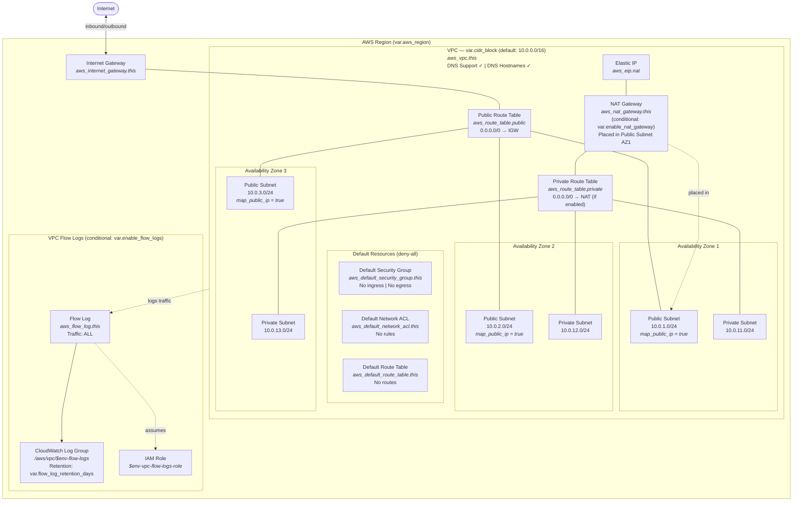
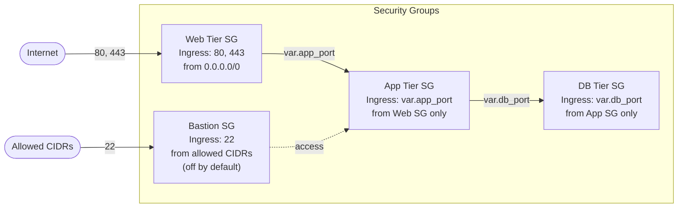

# Infrastructure Architecture

This diagram represents the AWS infrastructure provisioned by the modules in `infra/modules/`.

## VPC Network Topology

## Security Groups (infra/modules/security_groups)

## Resource Summary

### VPC Module

| Resource                              | Count        | Conditional                |
| ------------------------------------- | ------------ | -------------------------- |
| `aws_vpc`                             | 1            | No                         |
| `aws_default_security_group`          | 1            | No                         |
| `aws_default_network_acl`            | 1            | No                         |
| `aws_default_route_table`            | 1            | No                         |
| `aws_internet_gateway`                | 1            | No                         |
| `aws_subnet` (public)                 | 3 (per AZ)   | No                         |
| `aws_subnet` (private)                | 3 (per AZ)   | No                         |
| `aws_route_table` (public)            | 1            | No                         |
| `aws_route_table` (private)           | 1            | No                         |
| `aws_route` (public → IGW)           | 1            | No                         |
| `aws_route` (private → NAT)          | 1            | `var.enable_nat_gateway`   |
| `aws_route_table_association` (public) | 3           | No                         |
| `aws_route_table_association` (private)| 3           | No                         |
| `aws_nat_gateway`                     | 1            | `var.enable_nat_gateway`   |
| `aws_eip`                             | 1            | `var.enable_nat_gateway`   |
| `aws_flow_log`                        | 1            | `var.enable_flow_logs`     |
| `aws_cloudwatch_log_group`            | 1            | `var.enable_flow_logs`     |
| `aws_iam_role` (flow logs)            | 1            | `var.enable_flow_logs`     |
| `aws_iam_role_policy` (flow logs)     | 1            | `var.enable_flow_logs`     |

### Security Groups Module

| Resource                     | Count | Conditional            |
| ---------------------------- | ----- | ---------------------- |
| `aws_security_group` (web)   | 1     | `var.create_web_sg`    |
| `aws_security_group` (app)   | 1     | `var.create_app_sg`    |
| `aws_security_group` (db)    | 1     | `var.create_db_sg`     |
| `aws_security_group` (bastion)| 1    | `var.create_bastion_sg`|
| `aws_security_group_rule`    | 3 per SG | Per SG toggle       |

## Key Design Decisions

- **Default resources managed with deny-all** — prevents use of AWS default SG/NACL/RT which have permissive rules
- **Single NAT Gateway** in AZ1 for cost efficiency — suitable for dev/staging. For production HA, deploy one NAT per AZ.
- **Subnet CIDRs** computed dynamically via `cidrsubnet()` — public subnets use offsets 1-3, private subnets use offsets 11-13.
- **3 AZs** selected automatically from available zones in the region via `data.aws_availability_zones`.
- **NAT Gateway** is conditional (`var.enable_nat_gateway`, default `false`) to avoid cost when not needed.
- **VPC Flow Logs** enabled by default (`var.enable_flow_logs`, default `true`) for security monitoring.
- **Layered security groups** — each tier only accepts traffic from the tier above it (Internet → Web → App → DB).
- **Bastion off by default** — must explicitly enable and provide allowed CIDRs.
- **Default tags** (`ManagedBy = "opentofu"`, `Environment`) applied at both provider level and resource level.
