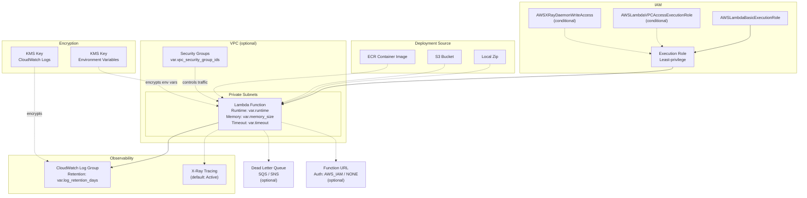

# Lambda Architecture

## FedRAMP Control Mapping

| Control | ID | Implementation |
| --- | --- | --- |
| Encryption in Transit | SC-8 | VPC deployment, TLS for function URLs |
| Encryption at Rest | SC-28 | KMS encryption for env vars and CloudWatch logs |
| Least Privilege | AC-6 | Scoped execution role, no wildcard IAM actions |
| Audit Events | AU-2 | CloudWatch log group with configurable retention |
| Monitoring | SI-4 | X-Ray tracing enabled by default |
| Boundary Protection | SC-7 | Optional VPC placement with security groups |

## Design Decisions

- **VPC placement optional** — not all Lambda functions need VPC access; VPC adds cold start latency
- **X-Ray tracing on by default** — provides distributed tracing for debugging and compliance
- **KMS encryption separated** — distinct keys for env vars vs logs allows independent key rotation
- **Dead letter queue optional** — for async invocations, prevents silent message loss
- **Function URL auth defaults to AWS_IAM** — prevents unauthenticated public access
- **Log group created before function** — explicit dependency ensures logs are captured from first invocation
- **Reserved concurrency configurable** — prevents runaway invocations from consuming account-wide limits
