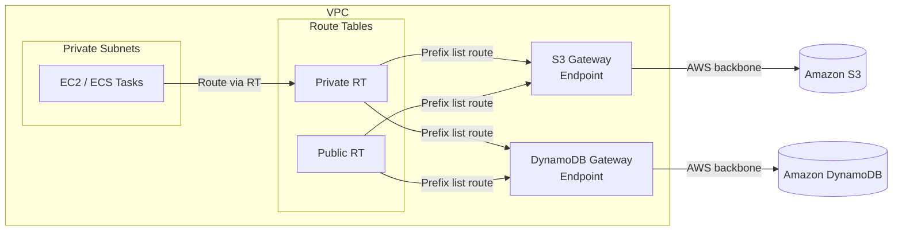

# VPC Endpoints Architecture

## Overview

Gateway VPC Endpoints route traffic to S3 and DynamoDB over the AWS private backbone, eliminating the need for NAT Gateways, internet gateways, or public IP addresses for these services.

## Architecture Diagram

## How It Works

1. When a Gateway endpoint is created, AWS adds a route to each associated route table
2. The route uses a **prefix list** (managed by AWS) containing the IP ranges for the service
3. Traffic matching these prefixes is routed to the endpoint instead of the internet
4. The endpoint policy (optional) controls which S3 buckets or DynamoDB tables are accessible

## Design Decisions

| Decision | Rationale |
| --- | --- |
| Gateway (not Interface) for S3/DynamoDB | Gateway endpoints are free; Interface endpoints incur hourly + data charges |
| Endpoint policy defaults to full access | Restrictive policies should be set per-environment via the `s3_endpoint_policy` variable |
| Both public and private route tables | Ensures all subnets route S3/DynamoDB traffic over the private network |
| DynamoDB disabled by default | Not all workloads use DynamoDB; opt-in reduces unnecessary resources |

## Security Considerations

- **Endpoint policies**: Use `s3_endpoint_policy` to restrict which buckets are accessible from the VPC
- **Bucket policies**: Combine with S3 bucket policies using `aws:sourceVpce` condition to enforce VPC-only access
- **No public internet**: Traffic stays within AWS infrastructure, satisfying FedRAMP SC-7 boundary protection
