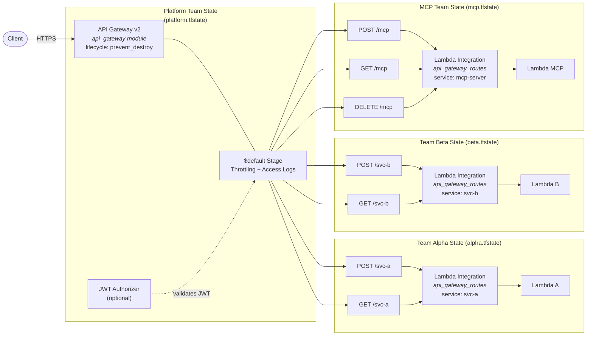

# API Gateway Routes Module

Per-service route isolation for a shared API Gateway v2. Each team uses their own instance of this module to independently manage routes, integrations, and Lambda permissions without affecting other services.

## Architecture



Each team's `tofu apply` only touches resources within their subgraph. The shared gateway has `lifecycle { prevent_destroy = true }` — no team can accidentally delete it.

## Usage

### Basic Routes (No Auth)

```hcl
module "health_routes" {
  source = "git::https://github.com/jsandov/cloud-voyager-infra.git//infra/modules/api_gateway_routes?ref=v1.0.0"

  api_id            = module.shared_api.api_id
  api_execution_arn = module.shared_api.execution_arn
  service_name      = "health-check"

  lambda_function_name = module.health_lambda.function_name
  lambda_invoke_arn    = module.health_lambda.invoke_arn

  routes = {
    "GET /health" = {}
  }
}
```

### Routes with Shared JWT Authorizer

```hcl
module "mcp_routes" {
  source = "git::https://github.com/jsandov/cloud-voyager-infra.git//infra/modules/api_gateway_routes?ref=v1.0.0"

  api_id            = module.shared_api.api_id
  api_execution_arn = module.shared_api.execution_arn
  service_name      = "mcp-server"

  lambda_function_name = module.mcp_lambda.function_name
  lambda_invoke_arn    = module.mcp_lambda.invoke_arn

  routes = {
    "POST /mcp" = {
      authorization_type   = "JWT"
      authorizer_id        = module.shared_api.authorizer_id
      authorization_scopes = ["mcp/invoke"]
    }
    "GET /mcp" = {
      authorization_type   = "JWT"
      authorizer_id        = module.shared_api.authorizer_id
      authorization_scopes = ["mcp/invoke"]
    }
    "DELETE /mcp" = {
      authorization_type   = "JWT"
      authorizer_id        = module.shared_api.authorizer_id
      authorization_scopes = ["mcp/invoke"]
    }
  }
}
```

### Multi-Team with Separate State Files

Team Alpha manages their routes in `team-alpha.tfstate`:

```hcl
data "terraform_remote_state" "platform" {
  backend = "s3"
  config = {
    bucket = "infra-state"
    key    = "platform/terraform.tfstate"
    region = "us-east-1"
  }
}

module "billing_routes" {
  source = "git::https://github.com/jsandov/cloud-voyager-infra.git//infra/modules/api_gateway_routes?ref=v1.0.0"

  api_id            = data.terraform_remote_state.platform.outputs.api_id
  api_execution_arn = data.terraform_remote_state.platform.outputs.execution_arn
  service_name      = "billing"

  lambda_function_name = aws_lambda_function.billing.function_name
  lambda_invoke_arn    = aws_lambda_function.billing.invoke_arn

  routes = {
    "POST /billing/invoices" = {
      authorization_type = "JWT"
      authorizer_id      = data.terraform_remote_state.platform.outputs.authorizer_id
    }
    "GET /billing/invoices" = {
      authorization_type = "JWT"
      authorizer_id      = data.terraform_remote_state.platform.outputs.authorizer_id
    }
  }
}
```

Team Alpha's `tofu apply` only creates/modifies the billing routes. It cannot touch any other team's routes.

## State Isolation

For multi-team safety, each service's `api_gateway_routes` instance **must** live in a separate OpenTofu state file (or workspace). This guarantees:

- One team's `tofu apply` cannot modify another team's routes
- A bad merge cannot silently remove another team's routes
- Each team can apply independently without coordination

The shared `api_gateway` module should live in the platform team's state, separate from all service states.

## Per-Route Throttle Overrides

Route-level throttling is configured on the `aws_apigatewayv2_stage` (owned by the `api_gateway` module). To set per-route throttle limits, coordinate with the platform team to add entries to the `route_throttle_overrides` variable on the shared gateway:

```hcl
module "shared_api" {
  source = "..."

  route_throttle_overrides = {
    "POST /mcp" = {
      throttling_rate_limit  = 100
      throttling_burst_limit = 50
    }
    "POST /billing/invoices" = {
      throttling_rate_limit  = 200
      throttling_burst_limit = 100
    }
  }
}
```

## Inputs

| Name | Type | Default | Required | Description |
| --- | --- | --- | --- | --- |
| `api_id` | `string` | --- | yes | ID of the shared API Gateway |
| `api_execution_arn` | `string` | --- | yes | Execution ARN for Lambda permissions |
| `service_name` | `string` | --- | yes | Unique service name (scopes permission statement IDs) |
| `lambda_function_name` | `string` | --- | yes | Lambda function name |
| `lambda_invoke_arn` | `string` | --- | yes | Lambda invoke ARN |
| `routes` | `map(object)` | --- | yes | Route key to config map (see Usage) |
| `payload_format_version` | `string` | `"2.0"` | no | Lambda integration payload format |
| `tags` | `map(string)` | `{}` | no | Additional tags |

### Route Object Fields

| Field | Type | Default | Description |
| --- | --- | --- | --- |
| `authorization_type` | `string` | `"NONE"` | `"NONE"` or `"JWT"` |
| `authorizer_id` | `string` | `null` | ID of the authorizer (from `api_gateway.authorizer_id`) |
| `authorization_scopes` | `list(string)` | `null` | OAuth scopes required for this route |

## Outputs

| Name | Description |
| --- | --- |
| `integration_id` | Lambda integration ID |
| `route_ids` | Map of route key to route ID |
| `route_keys` | List of route keys managed by this instance |
